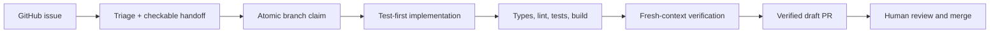

# Reel Good: a worked software factory demo

**Reel Good shows the complete path from a GitHub issue to a tested, independently
verified draft pull request using [Factory](https://github.com/addyosmani/factory). It is
also a small TMDB movie app you can run with your Claude Code or Codex subscription.**

A coding agent can already build a feature quickly. The factory adds the parts that become
important when you want the work to continue without supervising every prompt: a queue,
explicit risk boundaries, deterministic claims, fail-closed checks, independent review,
durable run evidence, and a deliberate handoff to a human.



The human stays in the loop at the consequential point. Factory agents never merge.

## What is in the demo?

The baseline app has a responsive discovery page and movie details backed by TMDB. The
factory then picked up three GitHub issues:

- [Local favorites and a watchlist](https://github.com/addyosmani/factory-demo/pull/7)
- [A persistent light and dark theme](https://github.com/addyosmani/factory-demo/pull/6)
- [An accessible quick finder](https://github.com/addyosmani/factory-demo/pull/8)

These are draft PRs on purpose. Each has an issue handoff, deterministic `claude/fq-*`
claim branch, new regression test, exact gate verdict, negative-test proof, immutable run
record, and independent verifier result. PR #7 also records a useful recovery path: green
gates were not enough, the verifier rejected over-persistence in local storage, and a human
comment authorized a narrowly scoped retry.

## Run the app

You need Node.js 20.9 or newer and your own [TMDB API key](https://www.themoviedb.org/settings/api).

```bash
npm install
cp .env.example .env.local
# Add your own key to TMDB_API_KEY in .env.local
npm run dev
```

Open [http://localhost:3000](http://localhost:3000). `TMDB_API_KEY` is read only from the
server-side data module. `.env.local` is ignored by Git and must not be committed.

For a deterministic preview with no key or network requests:

```bash
TMDB_USE_MOCKS=true npm run dev
```

## Reproduce the workshop

There are two useful checkpoints:

| Checkpoint | Branch | Commit | Use it for |
|---|---|---|---|
| App, no factory | [`workshop-start`](https://github.com/addyosmani/factory-demo/tree/workshop-start) | `ef02553` | Install and configure Factory yourself |
| App + configured factory | [`factory-ready`](https://github.com/addyosmani/factory-demo/tree/factory-ready) | `5da7571` | Create issues and run the queue immediately |

Follow the [step-by-step workshop](docs/WORKSHOP.md) for Claude Code Desktop and Codex in
the ChatGPT desktop app. It covers forking from a checkpoint, local secrets, the first
prompts, GitHub labels, issue handoffs, implementation, verification, human recovery, and
optional scheduling.

## Project checks

```bash
npm run typecheck
npm run lint
npm test
npm run build
./.claude/scripts/gates.sh full
./.factory/scripts/doctor.sh
```

The factory gate ends with one machine-readable `FACTORY_GATES:` line. Missing required
checks produce `MISCONFIGURED`, not a convenient green result.

## Boundaries worth noticing

- Unattended work cannot touch `lib/tmdb.ts`, environment files, package manifests, or the
  factory policy. Remote TMDB search and account-backed favorites therefore need a human
  spec; the quick finder intentionally searches only data already on the page.
- The committed fixture mode makes checks reproducible without giving an unattended agent
  your TMDB credential.
- GitHub labels and the latest `factory-handoff:v1` issue comment are the live queue.
  Markdown queue files are evidence, not synchronization.
- Three items awaiting review trigger back-pressure. Producing more PRs is not progress if
  nobody has capacity to read them.

## TMDB attribution

This product uses the TMDB API but is not endorsed or certified by TMDB. The app uses an
approved TMDB mark and keeps the required notice in its About section. See the
[TMDB API terms](https://www.themoviedb.org/documentation/api/terms-of-use).

## License

[MIT](LICENSE)
